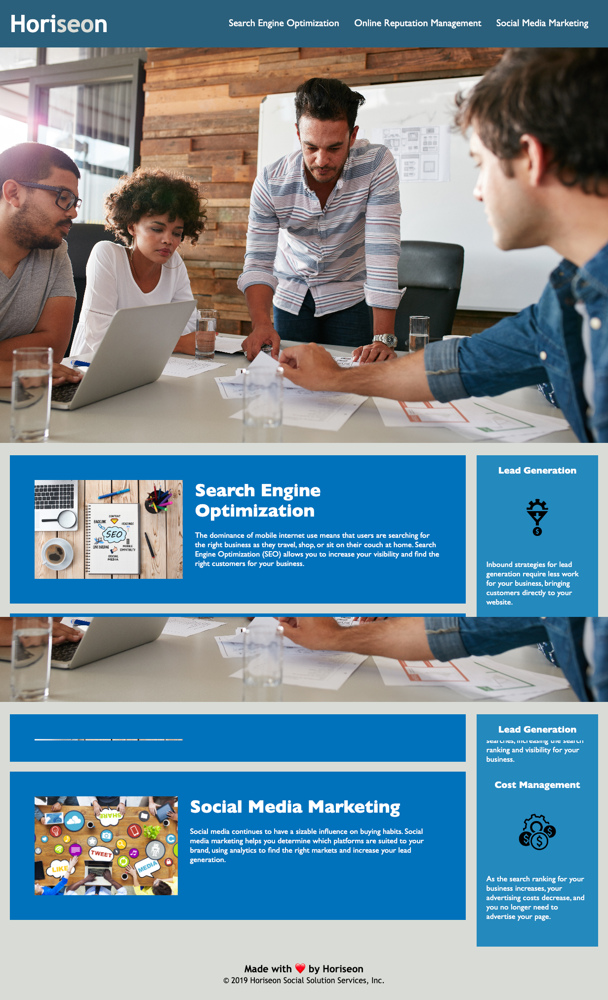

# Discription: 
Week 1 challenge I did a code refactor for Horeseon. In this challenge I removed the divs and added in sections to make the html code more user friendly. In css sytle sheet, I combined like codes and changed the main classes to reflect the same code in each section. I simplified the css style sheet to be condensed into a more concise sheet. To finish the project I took a png screen shot using GoFullPage and attached it to the README file.

[deployed site](https://mmockus15.github.io/code-refactor-horiseon/)

## acceptance criteria
GIVEN a webpage meets accessibility standards
WHEN I view the source code
THEN I find semantic HTML elements
WHEN I view the structure of the HTML elements
THEN I find that the elements follow a logical structure independent of styling and positioning
WHEN I view the icon and image elements
THEN I find accessible alt attributes
WHEN I view the heading attributes
THEN they fall in sequential order
WHEN I view the title element
THEN I find a concise, descriptive title
